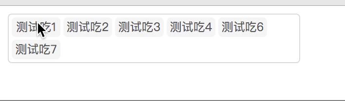

### simple-react-draggable

简单的可拖拽的react组件, 不依赖任何第三方的库

### example(demo)
<p align="center">
  
</p>

##### 结合antd Select折中的支持排序方案(理想的情况重构Select组件)

<p align="center">
  
</p>

##### 解决什么问题?

  - 来源于运营同学的需求;
  - 在用[antd](https://github.com/ant-design/ant-design)的select组件时, mode:multiple时, 选中的tag不能排序; 有时需要对选中数据执行调整顺序时, 需要删掉数据,然后在添加数据;

### Usage

  npm/cnpm i simple-react-draggable

  - Props

| Attribute    | Description     | Type        | Accepted Values    | Default |
| ------------ | ------------    | ----------  | ------------------ | ------- |
| list         |   data          | Array       | [{id,name}]        |   []    |
| option       |   config        | {}          |                    |         |
| className    | container style | css string  | any                |         |
| itemClassName| each item style | css string  | any                |         |
| onMove       | listener        | function    |     callback       |         |

  - example
  ```js
    import Draggable from 'simple-react-draggable';
    const list = [{
      id: 1,
      name: '测试1'
    },{
      id: 2,
      name: '测试2'
    },{
      id: 3,
      name: '测试3'
    },{
      id: 4,
      name: '测试4'
    },{
      id: 5,
      name: '测试6'
    },{
      id: 7,
      name: '测试7'
    }];

    <Draggable list={list}/>
  ```

##### 参数说明

> 配置:

  - option: (可选)
    - offsetX: item的左右间隔距离
    - offsetY: item的上下间隔距离
    - width:   item的宽度
    - height:  item的高度
    - defaultOption: 
    ```js
        const defaultOption = {
            width: 50, 
            height: 20,
            offsetX: 3,
            offsetY: 3
        };
    ```

  - itemClassName: (可选)
    - 移动项的className
    - 移动项默认的样式
    ```css
        .draggable-item {
          background: #f3f3f3;
          border-radius: 4px;
          overflow: hidden;
          cursor: default;
          font-size: 12px;
          color: rgba(0,0,0,0.65);
          text-align: center;
        }
    ```

  - className: (可选)
    - 容器的样式
    - 容器的样式
    ```css
    .wrapper {
      background: #fff;
      border-radius: 4px;
      border: 1px solid #d9d9d9;
      box-sizing: border-box;
      padding: 0;
      margin: 0;
    }
    ```

  - list: 需要排序的数据
    - type: [{id,name}]

  - onMove: 把移动后的数据返回
    - type:  callback

    - return: [{id, name}]

      

##### 实现的思路

 - 总的思路: 
   找到要移动的数据的index和目标位置的元素的index, but how?

   1. 每一个item元素bind onDragStart监听事件; 并记录每个元素的index(代码为position); 这一步获取移动数据的index

   ```js
    list.forEach((item,index) => {
      items.push(
        <div key={item.id}
          onDragStart = {(event) => this.onDragStart(event, index)}
          draggable
          style={{marginTop: offsetY, marginLeft: offsetX, width, height, lineHeight: height+'px'}}
          className={itemCls}
        >
          {item.name}
        </div>
      );
    })
   
    // onDragStart 记录index
     event.dataTransfer.setData("position", position);
   ```

   2. 获取目标位置元素的index: 容器中监听onDrop事件, 使用onDragOver防止事件冒泡; onDrap事件实现:
   ```js
    onDrop = (event) => {
        let {list} = this.state,
            position = event.dataTransfer.getData("position"),
            targetIndex = this.calculateTargetIndex(event.target),
            removeItem;
        let {onMove} = this.props;
        if(targetIndex !== -1){
            removeItem = list.splice(position, 1)[0];
            list.splice(targetIndex, 0, removeItem);
            this.setState({list});
            onMove && onMove(list)
        }
    }
   ```

   3. 在React计算元素的物理位置

   1).计算拖拽容器的x,y,以及每一行能显示多少移动元素
   ```js
    calculateDragContainer(){
        let { option: {offsetX, width} } = this.state;
        let c = ReactDOM.findDOMNode(this.refs.draggableContainer).getBoundingClientRect(),
            col = parseInt((c.width - offsetX) / (width + offsetX));
        return {
        x: c.x,
        y: c.y,
        col
        }
    }
   ```

    2). 计算item元素的x,y
    ```js
        calculateDragItem(target){
            var t = ReactDOM.findDOMNode(target).getBoundingClientRect();
            return {x: t.x, y: t.y}
        }
    ```
    3). 计算每一个list中的i数据的行列值
    ```js
    calculateIndexRowCol(i, maxCol) { // index row col
        let row, col;
        row = Math.ceil(i / maxCol);
        col = i % maxCol;
        if(col === 0) {
        col = maxCol;
        }
        return {row, col};
    }
    ```

    4). 计算目标位置的list元素的index
    ```js
    calculateTargetIndex(target){// 获取目标元素的index
        let { list, option: {width, height, offsetX, offsetY} } = this.state,
            c = this.calculateDragContainer(),
            t = this.calculateDragItem(target),
            targetIndex = -1,targetX,targetY, i,
            len = list.length;
        if(t.x !== c.x && list.length > 0){ // 鼠标落在目标item上
        for(i = 1; i <= len; ++i){
            let {row, col} = this.calculateIndexRowCol(i, c.col);
                targetX = ((col - 1) * width + col * offsetX) + c.x;
                targetY = ((row - 1) * height + row * offsetY) + c.y;
            if(targetX === t.x && targetY === t.y){
            targetIndex = i - 1;
            break; 
            }
        }
        }
        return targetIndex;
    }
    ```

